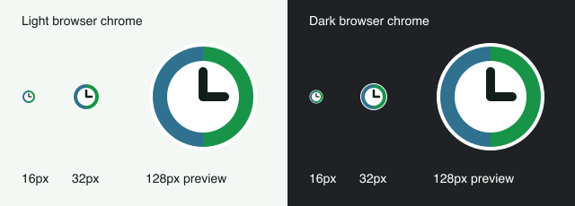

# Clock icon

The static clock uses the app's Work green (`#179447`) and Break blue
(`#2f718f`) in equal rim segments. A white face and outer edge keep the dark
hands and silhouette visible against light and dark browser chrome. It has no
ticks, digits, animation, or mode-dependent changes.



Next.js App Router discovers `app/icon.svg`, `app/favicon.ico`, and
`app/apple-icon.png` and adds their declarations. Do not add duplicate icon
metadata to the layout. The ICO contains 16×16 and 32×32 PNG entries; the Apple
touch icon is an opaque 180×180 PNG.

To regenerate the raster assets and preview after editing the SVG master:

```sh
pnpm install --frozen-lockfile
node scripts/generate-icons.mjs
```

The generator uses Sharp from the locked Next.js installation. Generated assets
are committed; serving icons requires no runtime image generation.

The icon Playwright test checks declarations, response content types, ICO image
entries, Apple image dimensions, and a static SVG URL across a mode switch. Run
against a deployed preview (or production after merge) with:

```sh
PLAYWRIGHT_BASE_URL=https://your-deployment.example pnpm exec playwright test e2e/icons.spec.ts
```

Also open that deployment in a browser and confirm its tab icon appears. Existing
tabs may need a reload because browsers cache favicons independently. Production
verification must follow deployment of this change.
